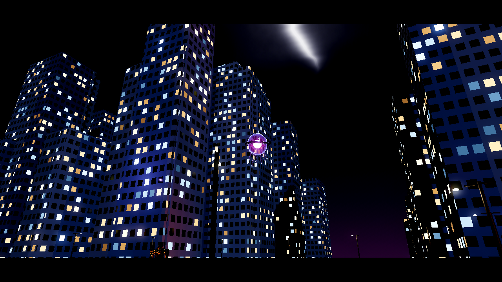
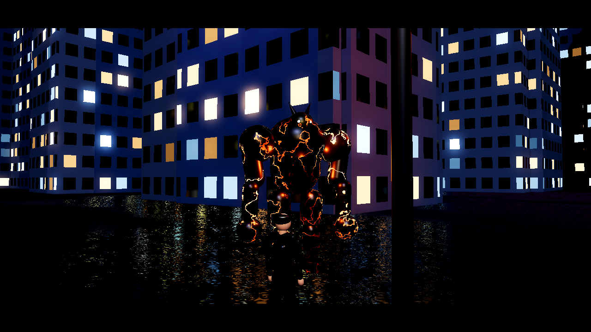
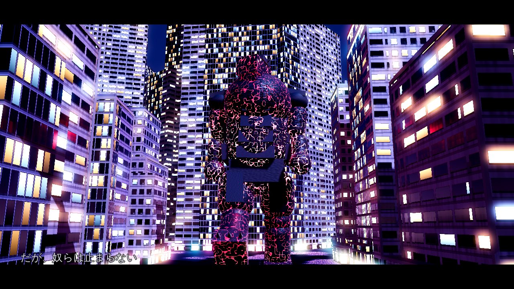
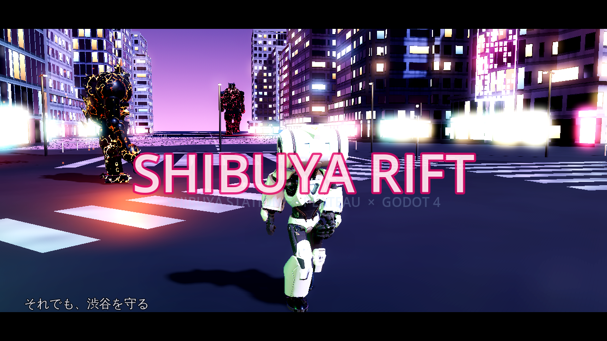

# SHIBUYA RIFT — PLATEAU 渋谷駅前 × Godot 4 シネマティック・アクションデモ

渋谷駅上空に「次元の裂け目」が開き、5種のモンスターが街に現れた——。

国土交通省 **PLATEAU の渋谷区 2025 実測3D都市モデル**
([plateau-13113-shibuya-ku-2025](https://www.geospatial.jp/ckan/dataset/plateau-13113-shibuya-ku-2025))
の渋谷駅周辺を舞台に、**Poly Haven 公式 API** から自動取得した
HDRI / 写真測量PBR / フォトグラメトリ樹木・岩で画を作る、
Godot 4.4 (Forward+) 製の 3D アクション + 60秒シネマティックデモです。

- 三人称アクション: 雨の渋谷を探索し、モンスター5種と戦う
- `--demo` / Movie Maker モード: 8ショット構成の60秒デモを **MP4 (1080p/4K, 60fps)** に書き出し
- すべての外部アセットは**無くても起動**し、取得すると自動で実データ品質に切り替わる
- 起動ごとに `QualityAudit` が AAA チェックリストで自己採点 (詳細: [docs/QUALITY_LOG.md](docs/QUALITY_LOG.md))

対象環境: **Windows 11 / RAM 64GB / RTX 5080** (RTX 5080 なら全機能を既定値のまま 4K で回せます)

| | |
|---|---|
|  |  |
|  |  |

*スクリーンショットは CI 環境のソフトウェアレンダリング (互換レンダラ / アセット未取得のフォールバック都市) での撮影。
RTX 5080 + Forward+ では SDFGI / SSR / SSIL / ボリュメトリックフォグ / TAA が全て有効になり、
PLATEAU 実測都市 + Poly Haven 実写アセットでさらに品質が上がります。*

---

## セットアップ (Windows 11)

### 0. 必要ソフト

| ソフト | 入手 |
|---|---|
| Python 3.11+ | https://www.python.org/downloads/ (追加ライブラリ不要・標準ライブラリのみ) |
| Godot 4.4.x (標準版) | https://godotengine.org/download/windows/ |
| ffmpeg (MP4変換用) | `winget install Gyan.FFmpeg` |

### 1. アセット自動取得

```bat
setup_windows.bat
```

これだけで以下が走ります (合計数GBのダウンロード、初回 10〜40分):

0. **キャラクター** (`tools/fetch_characters.py`) — リグ+スケルタルアニメ付きの実3Dモデルを取得
   - **Godette** (Godot 公式 TPS デモ, CC-BY 3.0): 約39,000頂点 / 4K PBR (albedo+ORM+normal+emissive) /
     55 アニメーション (idle・walk・run・4段階ジャンプ・怯み 他) → プレイヤーとして自動使用
   - **Mannequiny** (GDQuest, CC-BY 4.0): 軽量フォールバック (idle/run/jump/punch/kick)
1. **Poly Haven** (`tools/fetch_polyhaven.py`) — 公式 API で
   夜/夕/昼の HDRI (4K)、アスファルト・歩道・コンクリート等の PBR 5セット、
   写真測量された樹木4種・岩4種 (glTF) を取得 → `game/assets/polyhaven/`
2. **PLATEAU** (`tools/fetch_plateau.py`) — CKAN API で渋谷区 2025 の CityGML を発見・取得し、
   渋谷スクランブル交差点から半径 700m の建物 (LOD2、外観テクスチャ付き) だけを抽出して
   OBJ に変換 → `game/assets/city/`

個別実行やオプション (`--radius 1000`, `--hdri-res 8k`, `--zip 手動DL済み.zip` など) は
各スクリプトの `--help` を参照。

### 2. ゲーム起動

Godot で `game/project.godot` を開き (初回インポート数分)、**F5**。

| 操作 | キー |
|---|---|
| 移動 / 疾走 / ジャンプ | WASD / Shift / Space |
| カメラ | マウス |
| 攻撃 | 左クリック |
| マウス解放 | Esc |

起動オプション: `--preset=night|dusk|day` (既定 night)、`--demo` (60秒デモ再生)

### 3. 60秒デモ MP4 作成

```bat
py -3 tools\make_demo_mp4.py --godot "C:\path\to\Godot_v4.4.1-stable_win64.exe"
:: 4K で出す場合
py -3 tools\make_demo_mp4.py --godot ... --resolution 3840x2160 --preset night
```

Godot の Movie Maker モードで **60fps 固定・1フレームずつ確定レンダリング**した後、
ffmpeg (x264 CRF16) で `output/shibuya_rift_demo_*.mp4` に変換します。
リアルタイムではないため RTX 5080 でも実時間より長くかかります (1080p で 5〜15分程度)。

---

## 画作りの構成 (AAA チェックリスト)

- **建物**: PLATEAU 実測 LOD2 メッシュ + 外観写真テクスチャ。無地面には
  ワールド座標窓グリッドのファサードシェーダー (夜間ランダム点灯・ちらつき・色調差)
- **質感**: Poly Haven 写真測量 PBR (albedo/normal/rough/AO/disp) をトリプラナー適用。
  路面は fbm 水たまり + 雨滴リップル + SSR の濡れ表現
- **ライティング**: HDRI IBL + SDFGI + SSR + SSAO + SSIL + ボリュメトリックフォグ +
  ACES トーンマップ + ブルーム + 街灯/ネオン数十灯 (クラスタード) + 雨 6000 粒
- **人間**: 実3Dモデル + スケルタルアニメーション。優先順:
  ① `player.glb` (ユーザー差し替え: フォトスキャン/Mixamo等) → ② Godette (39k頂点+4K PBR+55アニメ)
  → ③ Mannequiny → ④ パラメトリック人体。
  idle/walk/run のブレンド、ジャンプ3段階 (踏切/滞空/着地)、攻撃モーションを速度連動で自動再生
- **建物ディテール**: 手続き生成ビルは基壇+タワー+セットバック+パラペット+屋上設備
  (室外機・ペントハウス・高架水槽・アンテナ+航空障害灯)+屋上ビルボード+壁面縦看板の
  アーキタイプ構成。ファサードはパンチ窓/カーテンウォール/リボン窓の3様式 ×
  マリオン・床スラブ・雨だれ汚れ・1F店舗階 (大開口ガラス+店内光+看板色スピル)・御影石基壇
- **モンスター5種** (各50〜100パーツの多層造形 + 多関節二次モーション + 常時パーティクル):
  カゲオニ (肋骨装甲・炉心・鎖枷・膝肘関節・残り火) / ネオンリッパー (首2節・可動顎・歯列・
  尾5節+フィン・ネオン管・鎌爪・トレイル) / ゲンブ (甲羅六角板・回転ルーン環・苔・嘴・足首関節) /
  スクランブラー (二重逆回転リング・コアケージ・軌道球・触手8本×4節・膜スカート) /
  トシクイ (装甲板・炉心格子・背ビレ2列・尾3節+スパイク・3本爪・火の粉)。
  全種が専用シェーダー (微細法線・鉱物きらめき・装甲継ぎ目)・AI・被弾フラッシュ・ディゾルブ消滅を持つ
- **カメラ**: クレーン/ドリー/トラッキング/オービットの8ショット + ショット別 DoF +
  レターボックス + タイトル

## リポジトリ構成

```
tools/    Python パイプライン (PLATEAU取得・CityGML→OBJ・PolyHaven取得・MP4書き出し)
game/     Godot 4.4 プロジェクト (scripts/ shaders/ scenes/)
docs/     QUALITY_LOG.md (自己評価反復ログ) / PIPELINE.md (データフロー)
```

## ライセンス / 出典

- 3D都市モデル: [PLATEAU](https://www.mlit.go.jp/plateau/) 渋谷区 2025 (国土交通省, CC BY 4.0) —
  クレジット表記例「出典: 国土交通省 PLATEAU 3D都市モデル (渋谷区)」
- HDRI / テクスチャ / モデル: [Poly Haven](https://polyhaven.com/) (CC0)
- プレイヤーキャラクター "Godette": [Godot TPS Demo](https://github.com/godotengine/tps-demo)
  (c) Juan Linietsky, Fernando Miguel Calabró (CC-BY 3.0)
- フォールバックキャラクター "Mannequiny": [GDQuest godot-3d-mannequin](https://github.com/gdquest-demos/godot-3d-mannequin) (CC-BY 4.0)
- コード: このリポジトリのコードは自由に利用してください
